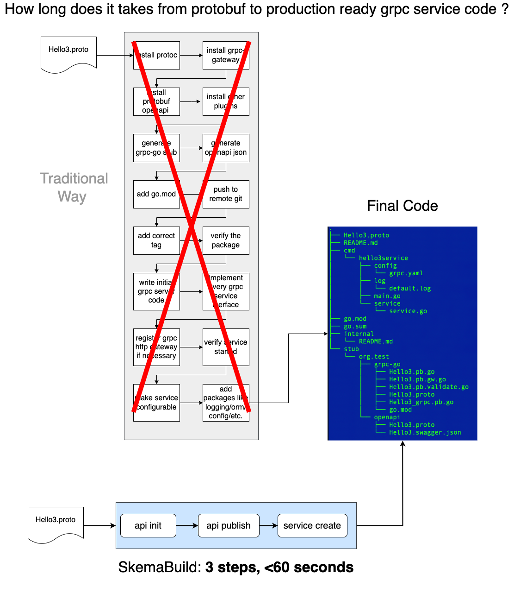

# SkemaBuild
Your One-Stop dev tool to generate grpc-go code from protobuf file AUTOMATICALLY.  
  


## Quick Start

### 1. Installation  
First, make sure you have golang installed.  
Then setup necessary protocol buffers related tools:  
```shell
/bin/bash -c "$(curl -fsSL https://raw.githubusercontent.com/skema-dev/skemabuild/main/script/install.sh)"
```
<hr/>

### 2. (Optional) Get Github Device Auth (if you want to publish protobuf&stubs on github)
```
skbuild auth
```
You'll be prompted to open github device auth URL and input the token. Then just press Enter to save the github token on your local device.
<hr/>

### 3. Init and Publish Protobuf API  
The most straightforward way to get everything done is by using a yaml file like below:
```
# e2e.yaml
api:
  proto: test1.proto
  stubs:
    - grpc-go
    - openapi

  version: v0.0.6
  path: https://github.com/likezhang-public/newst001/test001

service:
  name: mytestservice
  template:
    models:
      - user
      - message
    values:
      - mysql_server_name: mysql-svc
      - mysql_password: abcd1234
      - grpc_port: "9991"
      - http_port: "9992"
```
*Make sure you have a proto file ready (test1.proto) and defined go_package address inside*  
Then simply run:  
```
skbuild -f e2e.yaml
```
It's going to go through all the process from uploading stubs, packaging via git tag, get online template, generate code and even kubernetes deployment config!  

If you already have your protocol buffers file online. you may skip the proto packaging step in the yaml file. For example, in `/example` folder, you may use the `service_only.yaml` to generate code without manipulating stubs:  
```
# service_only.yaml
api:
  proto: test1.proto

service:
  name: mytestservice
  template:
    models:
      - user
      - message
    values:
      - mysql_server_name: mysql-svc
      - mysql_password: abcd1234
      - grpc_port: "9991"
      - http_port: "9992"
```
run command:  
```
skbuild -f service_only.yaml
```

For detailed introduction, checkout [Feature Introduction](./features.md)
